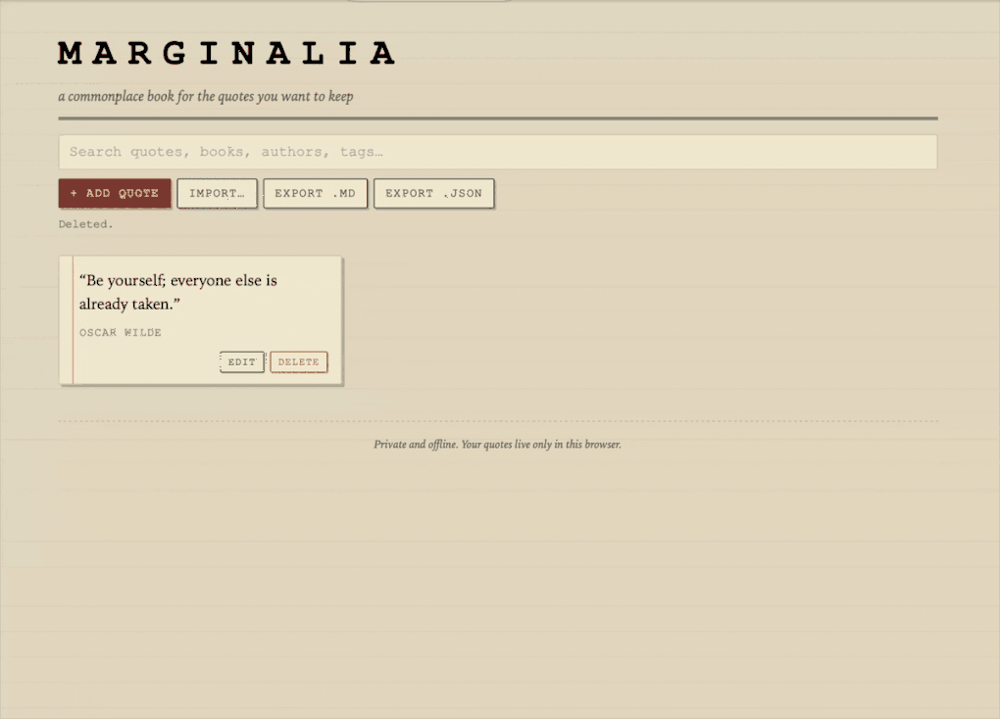

# Marginalia

**A local-first commonplace book for the quotes you love.**

<p align="center">
  
</p>

<p align="center">
  <a href="https://hapzter.github.io/marginalia/"><strong>Try the live demo</strong></a>
  &nbsp;·&nbsp; no install, no sign-up
</p>

Readers highlight passages everywhere (Kindle, notebooks, screenshots) and then
never see them again. Marginalia is a single, searchable home for those quotes that
lives entirely in your browser. No account, no server, no tracking. Your words never
leave your device.

> A *commonplace book* is the centuries-old practice of keeping the passages worth
> remembering in one place. This is that, for the web.

## Features

- **Add quotes by hand**: passage, book, author, page, tags, and a note.
- **Import Kindle highlights**: pick or drag in your `My Clippings.txt` and it's
  parsed *in your browser*; the file is never uploaded. Localized (non-English)
  Kindles are handled too.
- **Import KOReader highlights**: drop in a KOReader JSON export
  (Tools → Export highlights → Json).
- **Edit any quote** after the fact, including tagging imported highlights.
- **Search & filter** by text, book, author, or tag.
- **Export to Markdown or JSON**: your data, no lock-in, ever.
- **Works offline** and installs to your home screen (PWA). No app store.
- **Old-tech feel**: a library card-catalog aesthetic.

## Privacy & security

This is about the safest class of web app there is:

- **No filesystem access.** Import (file picker or drag-and-drop) is read-only; it only
  ever sees the file you hand it, nothing else on your device.
- **Nothing is uploaded.** All parsing runs locally; the app makes zero network requests.
- **XSS-hardened.** All quote text is rendered as inert text (never as HTML), backed by a
  strict Content-Security-Policy and **zero runtime dependencies**. A regression test
  (`tests/security.test.ts`) keeps it that way.
- Data is stored in your browser's `localStorage`, scoped to this site alone.

## Getting started

Requires Node 18+.

```bash
npm install
npm run dev      # local dev server at http://localhost:5173
npm test         # run the test suite
npm run build    # type-check + produce the static site in dist/
npm run preview  # serve the production build locally
```

### Trying the import

Use the included [`public/sample-clippings.txt`](public/sample-clippings.txt) via the
**Import…** button, or just drag the file onto the page. To import your own: connect your
Kindle by USB and copy `documents/My Clippings.txt`, or email that file to yourself and
pick it on your phone.

## Deploying (free, from GitHub)

The site is fully static, so it hosts anywhere. For GitHub Pages:

1. Push this repo to GitHub.
2. In **Settings → Pages**, set **Source** to **GitHub Actions**.
3. The included workflow ([`.github/workflows/deploy.yml`](.github/workflows/deploy.yml))
   runs the tests, builds, and publishes on every push to `main`.

The build uses a relative base path, so it works both at a user root
(`you.github.io`) and a project subpath (`you.github.io/marginalia/`) with no config.

## How it's built

Vite + TypeScript (strict), no framework, zero runtime dependencies. The logic lives in
small **pure functions** so the tests are deterministic and trustworthy:

| Module | Responsibility |
| --- | --- |
| `src/lib/parseKindle.ts` | Parse `My Clippings.txt` → entries (localization-tolerant) |
| `src/lib/parseKoreader.ts` | Parse KOReader JSON export → entries |
| `src/lib/quotes.ts` | Quote model, normalize, dedupe |
| `src/lib/search.ts` | Filter by text / tag / book / author |
| `src/lib/exporters.ts` | Markdown + JSON export & validated import |
| `src/lib/storage.ts` | `localStorage` seam (mockable) |
| `src/ui/render.ts` | DOM rendering (text-only, no `innerHTML`) |

## License

[MIT](LICENSE).
